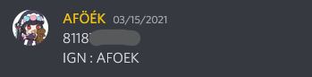

# Discord BOT for Jenshin Impact Mabar

### Brief
This BOT are build using python 3.9, and run using worker at Heroku, if you are developers and like to run this bot locally you can run it using `python3 main.py`. For dependency it just use `pandas numpy discord.py` and for installing all the dependency you can run `pip3 install -r requirements.txt`.

### Usage
For you who want to fork this bot or run it for your own, you need:
1. Github account
2. Heroku account (Optional, but better if you have it)
3. Discord account
4. Discord Developer mode activated

After you already create all the necessary account, you need to create bot in discord developer dashboard, and get the bot API Code (I don't post my API, and discord can detect if I post my API code to public). For running the bot you have 2 method:

1. **Bare metal**
    - First thing first, you need install all dependency tools `python3.9 pip3 discord`, after tools already downloaded you need to install all neccessary library to order bot can run properly use `pip3 install -r requirements.txt` .
    - After that you need make a `.env` file in your discord bot folder, in there you need to declare: 
        `DISCORD_TOKEN=[DISCORD_BOT_TOKEN_YOU_GET_WHEN_CREATING_BOT]` 
    - Finally you just run your python script from command line (CMD), terminal or powershell as long as your CLI can call `python3` globally. And your bot are online, after that you need to add the bot into a server and checking if the bot is working properly try to type `>>help` it's must give back a help prompt.

2. **Cloud hosted**
    - Do all step one of bare metal method, after that you need to create an application on Heroku.
    - After you setup an empty application on heroku, you need add `heroku/python` buildpacks, configs vars (this will contain you bot API code) and your github link for this bot (this is optional, you can push it using heroku git).
    - Push the bot into heroku, and wait for build is completed, and without errors. Make sure if bot is running with open heroku application logs, it will prompt if bot is connected
    - After that you need to add the bot into a server and checking if the bot is working properly try to type `>>help` it's must give back a help prompt.

## Disclaimer
- The bot need a dedicated text channel on discord server for handling user UID, and it's work better if the text chat are get formated like: `<UID>\newlineIGN:<Username>`, below is example of the formated chat:

        

- Since my UID data are unformated there are some of the code will make your UID data become corrupted, if your data corrupted please refer and edit the source code from line 36 to 45. Pandas knowledge are requiered !~~my brain just commited suicide when I trying to make a regex for that sh*t~~
- If there are multiple account you need to change, primary account flag like line 44 or line 45. Since the code are taking author message id.

## To-Do
- [x] Generate redeem link.
- [x] Hosted bot on PaaS (Heroku).
- [ ] Generate redeem link using UID in #UID channel text.
- [ ] List all user UID.
- [ ] Pull release patch note.
- [ ] Pull account stats using Hoyoverse public API.
- [ ] Pull battle Chronicle using Hoyoverse public API -> JPEG or PNG.